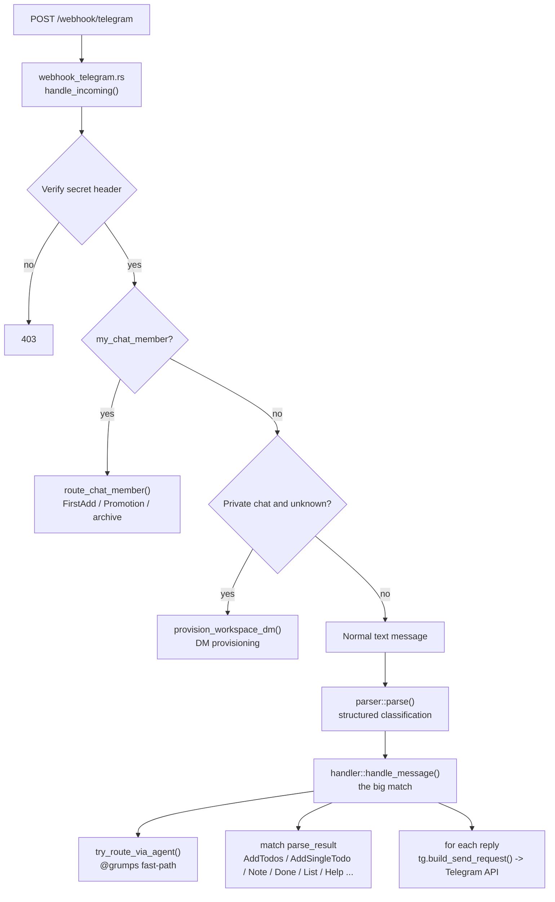

# Debugging Grumps

How to trace an inbound message (Telegram / WhatsApp / Discord) through the worker, confirm which code branches it takes, and step-debug the logic.

There is **no classic step-debugger** for Rust+WASM on Cloudflare Workers — you cannot set a breakpoint that pauses on an incoming request inside the running worker. Instead, debugging works at three levels: replay + live logs to observe the real path, structured log probes at decision points, and native `cargo test` for true breakpoint step-debugging of the pure logic.

## The path of an inbound message

A Telegram message flows like this:



The two branch points that matter most: `parser::parse` (`crates/nlu`) decides _what kind_ of message it is, and `handler::handle_message` (`crates/worker/src/handler.rs`) runs the matching branch. WhatsApp and Discord follow the same shape via their own webhook handlers (`webhook.rs`, `webhook_discord.rs`), converging on the same `handler::handle_message`.

## Level 1 — Replay a message and watch it live

The repo ships `replay-webhook.sh`, which forges a correctly-signed platform webhook (it reads the secret header from `.dev.vars`, the same file `wrangler dev` uses, so they always match) and POSTs it to your local worker. No real Telegram/WhatsApp account needed.

Use two terminals:

```bash
# Terminal A — the local worker, with logs streaming
npx wrangler dev          # → http://localhost:8787

# Terminal B — inject messages
./replay-webhook.sh tg "@grumps list"
./replay-webhook.sh tg "buy bread tomorrow 9am"     # natural language → LLM branch
./replay-webhook.sh tg "list" --dm                  # private chat (DM provisioning)
./replay-webhook.sh wa "TODO: buy bread"            # WhatsApp (needs WA_APP_SECRET in .dev.vars)
./replay-webhook.sh health                          # just hit /health
```

Env overrides for the Telegram replay: `BASE` (target URL), `TG_CHAT_ID`, `TG_USER_ID`, `LANG_CODE`. Each call uses a fresh epoch-based `message_id` so the KV dedup never silently swallows your replay.

Everything that goes through `console_log!` / `log_event()` prints directly in the `wrangler dev` terminal. Structured events appear as `[event] <name> {json}` — easy to grep. Against production, `npx wrangler tail` gives you the same live stream.

`test-webhook.sh` is a related smoke-test that fires a fixed sequence of WhatsApp payloads (TODO block, note, list, dedup check, help, …) — handy for a quick end-to-end sanity pass.

## Level 2 — Drop probes at the branch points

Since there are no breakpoints in the worker, the platform-native technique is **structured logging at decision points**, using the `observability::log_event()` helper. To confirm "the message takes branch X like I think", add a temporary probe:

```rust
// in handle_message, right after parser::parse
crate::observability::log_event("debug.parse", &serde_json::json!({
    "raw": clean_text,
    "variant": format!("{:?}", parse_result),
    "is_mention": inbound.is_mention_to_bot,
}));
```

Replay the message, read the `[event] debug.parse {...}` line in `wrangler dev`, and you know exactly which variant was chosen and which `match` arm will run. This is the practical equivalent of single-stepping on this platform. Remove the probe (or keep it behind a stable event name) once you're done.

## Level 3 — Real step-debugging on the pure logic

This is where an actual breakpoint debugger works. `parser::parse`, `route_chat_member`, and most of the `handler` decision logic are intentionally **pure and I/O-free**, so you can run them natively via `cargo test` on the Windows target — and there a real debugger (LLDB / CodeLLDB in VS Code, breakpoints, variable inspection) works normally:

```bash
PATH="/c/Users/mayer/.cargo/bin:$PATH" ~/.cargo/bin/cargo.exe test \
  --target x86_64-pc-windows-msvc -p grumps-nlu parse
```

`webhook_telegram.rs` already carries a battery of `route_chat_member` tests as a model. The recommended workflow for chasing a specific branch: write a native test that reproduces your exact input, then step-debug inside it. This isolates the logic from the Workers runtime (which itself is not step-debuggable).

## Quick reference

| Goal                       | Tool                                                   |
| -------------------------- | ------------------------------------------------------ |
| Run the worker locally     | `npx wrangler dev`                                     |
| Inject a fake message      | `./replay-webhook.sh tg "…"` (`--dm` for private chat) |
| Watch logs locally         | the `wrangler dev` terminal                            |
| Watch logs in production   | `npx wrangler tail`                                    |
| Confirm a branch was taken | add a `log_event("debug.…", …)` probe                  |
| True breakpoint step-debug | native `cargo test` on the pure logic                  |

## Strengthening diagnosis when something goes wrong

Every request now emits a correlation id derived from Cloudflare's `cf-ray` header (falls back to `local` under `wrangler dev`). Grep one request's whole journey with `wrangler tail | grep rid=<id>`.

Structured log lines, all greppable by `[level]` and `rid=`:

| Event        | When                                     | Fields                                                                                                                                        |
| ------------ | ---------------------------------------- | --------------------------------------------------------------------------------------------------------------------------------------------- |
| `http.in`    | every request, before routing            | `method`, `path`                                                                                                                              |
| `http.out`   | every request, after routing             | `status`, `ms` (latency); level is `error` for 5xx, `warn` for 4xx                                                                            |
| `error`      | any 5xx or `AppError::Internal`          | `where`, `detail`                                                                                                                             |
| `tg.message` | every inbound Telegram text              | `msg_id`, `is_mention`, `is_dm` (metadata only, no content)                                                                                   |
| `tg.trace`   | Telegram text, only when `DEBUG_TRACE=1` | `sender`, `text` (full content), `variant` (chosen `ParseResult`), `raw` (the full update body — replayable verbatim via `replay-webhook.sh`) |

Flip verbose content tracing on without redeploying: set `DEBUG_TRACE=1` (Cloudflare dashboard env var in prod, or `.dev.vars` locally). `tg.message` is always on and content-free; `tg.trace` carries the full message content and is gated.

Privacy: `tg.trace` writes real message content to Workers Logs (retained ~3 days, dashboard-visible) — fine pre-production, and easy to redact later since all content logging lives in that one gated event. Nothing is ever written to the committed repo.

### Retained logs (analysis after the fact)

`wrangler tail` only shows what streams while you are connected. Workers Logs is enabled (`[observability]` in `wrangler.toml`), so Cloudflare retains logs (~3 days) and makes them queryable in the dashboard: Workers → `grumps-api` → Logs. Filter by `rid=`, status, or `[error]` to find a specific failure after it happened.

### Panics

The worker installs `console_error_panic_hook` at start, so a panic surfaces a readable `panicked at 'msg', file:line` line instead of `RuntimeError: unreachable executed`. (The SPA already had its own hook in `crates/spa/src/main.rs` — that one covers the browser, this one covers the worker.)
